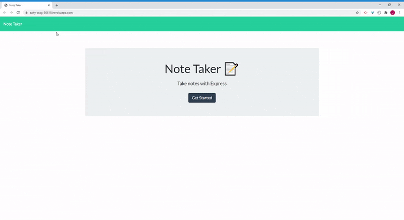

# Note Taker


## Table of Contents

- [Description](#description)
- [Installation](#installation)
- [Developing](#developing)
- [Demo](#demo)
- [Hosted App Link](https://salty-crag-50618.herokuapp.com/ (Note Taker))

---

## Description

A node application that can be used to write, save, and delete notes. This application will use express to post, get, and delete requests from a JSON file.


---

## Installation

To test this project, simply follow these steps:

```
step 1: git clone https://github.com/JDMartinez1531/11-note-taker.git

step 2: npm install

step 3: node index.js

```

---

## Developing

Below is a summary of the key files for this project and their purpose:

- **index.js** application main entry point
- **package.json** - node package definition
- **public/assets/css/style.css** - static style sheet.
- **public/assets/js/index.js** - static assets used by the project
- **public/index.html** - frontend welcome interface page
- **public/notes.html** - frontend notes interface page
- **routes/api/notes.js** - notes api
- **routes/html/notes.js** - HTML serving api
- **db/db.json** - JSON database

---


## Demo




---

## Licensing

"The code in this project is licensed under MIT license."

--- 

[Table of Contents](#table-of-contents)